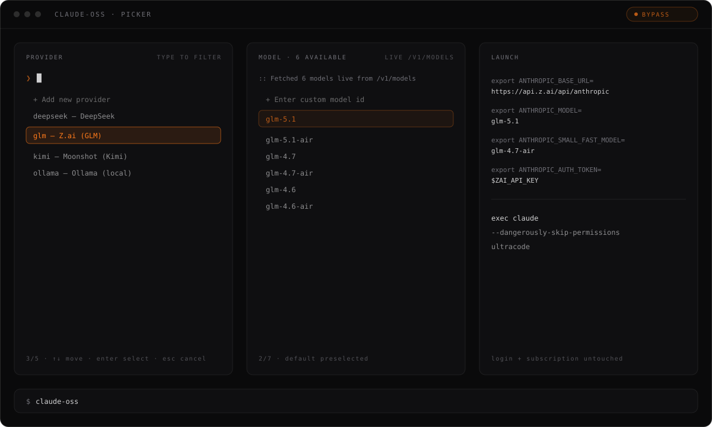

<p align="center">
  
</p>

# claude-oss

A boot menu for Claude Code. One command opens an interactive picker — provider,
model, permission mode — then launches `claude` pointed at GLM (Z.ai), DeepSeek,
Kimi (Moonshot), a local Ollama, or any Anthropic-compatible endpoint. Your
normal Anthropic login and subscription stay untouched.

Local-first. Open source. Built for people who ship.

## Install

```bash
git clone git@github.com:pickforge/claude-oss.git
cd claude-oss
ln -sf "$PWD/claude-oss" ~/.local/bin/claude-oss
```

Needs `bash`, `curl`, and `claude` in `PATH`. `jq` is used when present.

## Quickstart

```bash
claude-oss                      # pick provider -> model -> mode -> launch
claude-oss glm                  # skip the provider menu
claude-oss deepseek deepseek-v4-pro   # skip the model menu too
claude-oss last                 # relaunch exactly the last combo
claude-oss glm -- --continue    # everything after -- goes to claude verbatim
```

First launch of a provider asks for its API key (hidden input) unless the
key's env var — `ZAI_API_KEY`, `DEEPSEEK_API_KEY`, `MOONSHOT_API_KEY` — is
already exported.

### The picker

Every menu is the same control: **↑/↓** (plus PgUp/PgDn/Home/End) to move,
**type to filter**, **Enter** to select, **Esc** to cancel. The first entry is
always *Add new provider* or *Enter custom model id*, so a missing option is
never a dead end. Model lists are fetched live from the provider's
`/v1/models` endpoint (base URL first, then the API origin), falling back to
`MODELS_CMD` output and then the static `MODELS` list.

<p align="center">
  
</p>

Under the hood there is no proxy and no daemon: the launcher exports
`ANTHROPIC_BASE_URL`, `ANTHROPIC_AUTH_TOKEN`, and `ANTHROPIC_MODEL`, then
`exec`s `claude`.

## CLI reference

| Command                       | Does                                          |
|-------------------------------|-----------------------------------------------|
| `claude-oss`                  | interactive picker, then launch               |
| `claude-oss <provider> [model]` | launch directly, prompting only for what's missing |
| `claude-oss last`             | relaunch the previous provider/model/mode     |
| `claude-oss list`             | show configured providers and their models    |
| `claude-oss add`              | create a provider interactively               |
| `claude-oss edit <provider>`  | open the provider file in `$EDITOR`           |
| `claude-oss remove <provider>` | delete a provider                            |
| `claude-oss ... -- <args>`    | pass anything after `--` to `claude` verbatim |

## Permission modes

| Option    | What it passes to claude         |
|-----------|----------------------------------|
| `auto`    | `--permission-mode acceptEdits`  |
| `bypass`  | `--dangerously-skip-permissions` |
| `plan`    | `--permission-mode plan`         |
| `default` | nothing (normal prompting)       |

The **ultracode** toggle sends `ultracode` as the opening prompt, which enables
multi-agent workflow orchestration for the session.

## Provider config

One file per provider in `~/.config/claude-oss/providers/<name>.conf`, plain
`KEY="value"`, chmod 600. Seeded presets: `glm`, `deepseek`, `kimi`, `ollama`.

```bash
NAME="Z.ai (GLM)"                         # display name
BASE_URL="https://api.z.ai/api/anthropic" # Anthropic-compatible endpoint
AUTH_TOKEN=""                             # key stored here, or...
AUTH_TOKEN_ENV="ZAI_API_KEY"              # ...read from this env var
MODELS="glm-5.1 glm-4.7"                  # static fallback if /v1/models fails
DEFAULT_MODEL="glm-5.1"                   # preselected in the picker
SMALL_FAST_MODEL="glm-4.7-air"            # background tasks; falls back to the picked model
MODELS_CMD=""                             # shell cmd printing one model per line (optional)
EXTRA_ENV=""                              # extra exports, e.g. "FOO=1 BAR=2" (optional)
EXTRA_ARGS=""                             # extra claude flags always added (optional)
```

Key consoles: [GLM](https://z.ai/manage-apikey/apikey-list) ·
[DeepSeek](https://platform.deepseek.com/api_keys) ·
[Kimi](https://platform.moonshot.ai/console/api-keys) ·
Ollama needs no key (recent version with the Anthropic-compatible API).

For OpenAI-format-only gateways (e.g. OpenRouter), put a translation proxy
like LiteLLM in front and point a provider at it:

```bash
litellm --model openrouter/moonshotai/kimi-k2.6 --port 4000
# then: claude-oss add  ->  BASE_URL=http://localhost:4000
```

## Security / privacy

- API keys live in chmod-600 files under `~/.config/claude-oss/` or in env
  vars you already export — nothing is sent anywhere except to the provider
  you pick.
- Your prompts and code go to that provider, under its terms. Picking a local
  Ollama keeps everything on the machine.
- `ANTHROPIC_API_KEY` is unset in the launched process so your real Anthropic
  key can never leak to a third-party endpoint.
- `CLAUDE_CODE_DISABLE_NONESSENTIAL_TRAFFIC=1` is set on every launch.

## Development

```bash
bash -n claude-oss        # syntax check
shellcheck claude-oss     # lint
printf '1\n' | ./claude-oss list   # non-tty fallback smoke test
```

## License

MIT — see [LICENSE](LICENSE).

---

<p align="center">
  <a href="https://pickforge.dev">
    
  </a>
</p>
